# Canal de Comunicação - Documentação do Projeto

Bem-vindo à documentação oficial do **Canal de Comunicação (Homologação)**. Este sistema foi desenvolvido para integrar a base de dados do ERP Winthor (TOTVS) com uma interface ágil de comunicação e gestão de clientes, operando com integração direta ao WhatsApp através da Evolution API.

---

## Principais Soluções Oferecidas
- **WhatsApp Integrado ao ERP:** Comunique-se com os clientes sem precisar de celulares corporativos e sincronize dados em tempo real.
- **Auditoria Fiscal Automática (CNPJ/IE):** O sistema consulta dados do Sintegra/Receita Federal em background para evitar cadastros frios ou Inscrições Estaduais bloqueadas.
- **Disparos em Lote Seguros (Tickets):** Campanhas de reativação e envio de catálogos respeitam limites de tempo dinâmicos da API, evitando banimentos por SPAM.
- **Cross-sell Inteligente:** Baseado no histórico de compras do Winthor, sugere complementos de venda durante as conversas.

---

## Guia de Instalação Rápida
> [!TIP]
> Vai subir o projeto do zero? Elaboramos um guia rápido com os comandos do Docker e as configurações do `.env`!  
> **👉 [Clique aqui para ler o Guia de Instalação (INSTALL.md)](INSTALL.md)**

## Solução de Problemas Comuns (Troubleshooting)
Alguns cenários clássicos que você pode enfrentar (e como resolver):
*   **A tela (Frontend) não atualiza após o `git pull` (Windows):** O Docker utiliza a imagem antiga em cache ignorando os arquivos novos devido a dessincronização de *Volumes*. Resolva forçando um rebuild limpo:
    `docker compose build --no-cache frontend` seguido de `docker compose up -d --force-recreate frontend`.
*   **Erro de Banco Oracle NJS-116:** Ocorre porque o ERP usa *Password Verifiers* legados. A solução já está implementada: O backend ativa o *Thick Mode* (`oracledb.initOracleClient`). Certifique-se de não remover a instalação do Oracle Instant Client no Dockerfile do worker/backend.
*   **Erros ORA-00001 (Restrição Exclusiva) nos Crons:** Tratado usando `MERGE INTO` (Upsert) nos processos automatizados em vez de `INSERT`, evitando duplicidades em caso de concorrência.

---

## 1. Arquitetura de Banco de Dados

O banco de dados do sistema funciona de forma híbrida: ele consome os dados oficiais do ERP Winthor (somente leitura / views) e gerencia seu próprio estado através de tabelas locais (nativas).

### 1.1 Tabelas do Canal (Nativas)
As tabelas que pertencem exclusivamente à lógica do Canal de Comunicação recebem o prefixo `CANAL_` (ou nomenclaturas diretas de sistema). **Estas tabelas são criadas de forma nativa e automática** na inicialização do backend através de scripts `CREATE TABLE IF NOT EXISTS` e migrations diretas ao banco.

*   **`clientes` / `contatos`**: Armazenam os dados cacheados e telefones de WhatsApp vinculados ao ERP.
*   **`conversas` / `CANAL_MENSAGENS`**: Gerenciam as sessões de chat e o histórico de mensagens enviadas e recebidas.
*   **`CANAL_AGENDAMENTO_STATUS`**: Registra o andamento de agendamentos e tarefas automáticas do sistema.
*   **`CANAL_CONFIGURACOES`**: Guarda configurações dinâmicas de funcionamento, regras de negócio e gatilhos da plataforma.
*   **`CANAL_TOKENS_EVOLUTION`**: Tabela vital para gerenciar os Tokens e instâncias da API do WhatsApp (Evo API).
*   **`CANAL_WEBHOOK_STATE`**: Registra o estado das filas de eventos recebidos pela integração do WhatsApp para garantir a entrega e processamento assíncrono.
*   **`CANAL_TEMPLATES`**: Armazena os templates pré-aprovados ou modelos de respostas rápidas usados pelos atendentes.
*   **Outras Tabelas de Apoio**: `CANAL_VISITAS`, `CANAL_ROTAS`, `CANAL_LOG_ALTERACAO_VENDEDOR`, `CANAL_AVISOS`, `CANAL_REATIVACAO_FILA`, e `METRICAS_CROSS_SELL`.

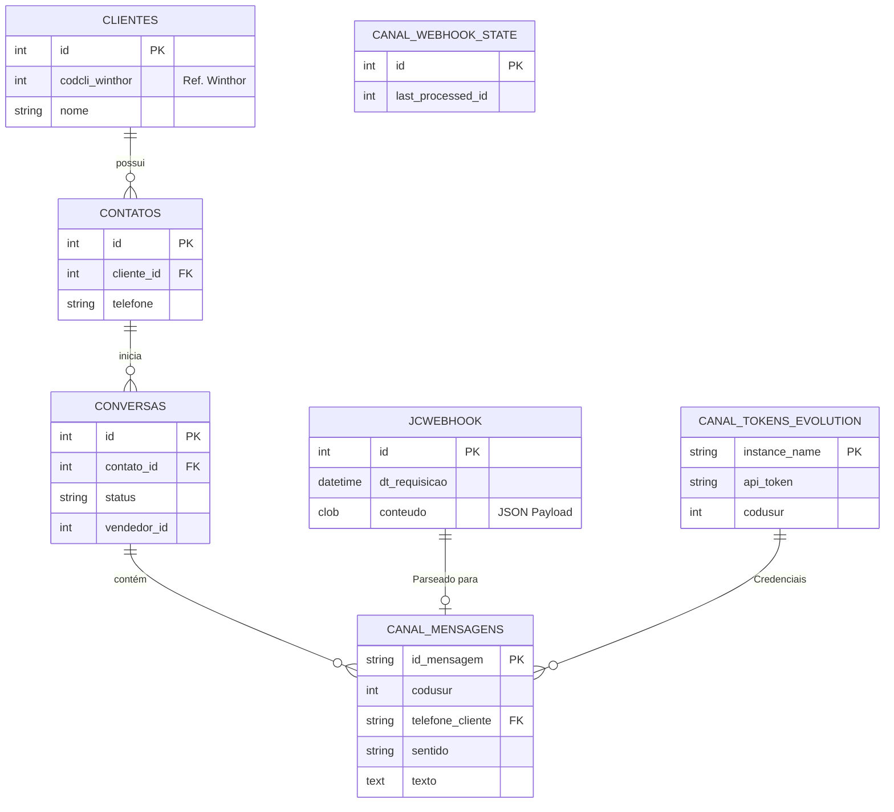

### 1.2 Tabelas e Views do ERP Winthor (PC)
O sistema lê informações vitais do ERP Winthor utilizando as tabelas base (que começam com `PC`), geralmente abstraídas por Views (`VW_CANAL_*`) para facilitar a consulta pela API.

*   **`PCCLIENT` (`VW_CANAL_CLIENTES`)**: Fornece o cadastro completo dos clientes, CNPJ, limites de crédito e regras de bloqueio.
*   **`PCPRODUT`, `PCPRODFILIAL`, `PCEMBALAGEM` (`VW_CANAL_PRODUTOS`)**: Onde o sistema busca os catálogos de produtos, embalagens e fatores de conversão.
*   **`PCEST` (`VW_CANAL_ESTOQUE`)**: Consulta do estoque atual, deduzindo saldos reservados e bloqueados.
*   **`PCTABPR` (`VW_CANAL_PRECOS`)**: Tabelas de preços atreladas às regiões dos clientes.
*   **`PCUSUARI`, `PCSUPERV`, `PCGERENTE` (`VW_CANAL_USUARIOS`)**: Estrutura oficial de usuários do Winthor para basear a autenticação e hierarquia.

---

## 2. Processos de Mensageria via WhatsApp

O envio e recebimento de mensagens são o coração do sistema, totalmente dependentes da **Evolution API (EVO API / GO)**, um serviço robusto para controle de instâncias e webhooks do WhatsApp.

> [!NOTE]
> Para maiores informações, aquisição ou suporte avançado sobre a **Evolution API (EVO GO)** e o servidor de **Webhooks**, entre em contato: **(12) 98137-1613**.

### 2.1 Fluxo de Integração (Evo API)
1. **Autenticação e Instâncias**: O backend lê a tabela `CANAL_TOKENS_EVOLUTION` para associar as contas de WhatsApp (Instâncias da Evo API) com os respectivos Vendedores ou Setores.
2. **Envio (Outbound)**: Quando um vendedor manda uma mensagem pelo painel, o backend salva na `CANAL_MENSAGENS` e faz um POST para a Evo API enviando o texto ou mídia.
3. **Recebimento Bruto (Buffer Inbound)**: Quando o cliente responde, a Evo API dispara um Webhook. Para suportar alta volumetria e não perder eventos, o JSON bruto (payload) de cada webhook é gravado imediatamente na tabela **`JCWEBHOOK`**. Ela funciona como uma fila de recepção ultrarrápida.
4. **Processamento Assíncrono e Histórico**: Um serviço em background (`webhookPoller.js`) faz a leitura contínua (polling) da `JCWEBHOOK`. Ao encontrar um evento novo, ele faz o *parse* do JSON, identifica o cliente, faz download/transcrição de áudios (via Groq/IA) e salva a mensagem limpa e estruturada de forma definitiva na tabela **`CANAL_MENSAGENS`**. É desta última tabela que o frontend carrega o histórico do chat.
5. **Automação**: Disparos de cobrança, campanhas de vendas e avisos são roteirizados pela tabela `CANAL_MENSAGENS_AUT_CONFIG`.

> [!IMPORTANT]
> **Requisito para Transcrição de Áudios (IA):** O sistema utiliza os modelos *Whisper* da Groq para realizar as transcrições automáticas de mensagens de voz com alta velocidade. Para que essa funcionalidade opere corretamente, é **obrigatório** possuir um Token (API Key) configurado na variável `GROQ_API_KEY` dentro do arquivo `.env`.
> Você pode gerar o seu token gratuitamente acessando o painel para desenvolvedores da Groq: [https://console.groq.com/keys](https://console.groq.com/keys).

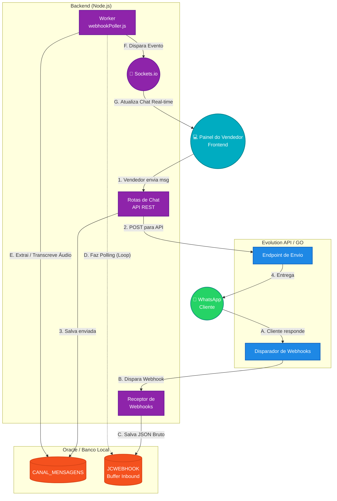

### 2.2 Tarefas em Segundo Plano (Workers e Crons)
O backend possui um processo secundário (`worker.js`) inteiramente dedicado a executar rotinas em background de tempos em tempos, preservando a performance e agilidade da API principal.
*   **Auditoria de CNPJ e I.E. (`cnpjCron.js` / `ieCron.js`):** Robôs que puxam novos clientes do ERP (que possuem CNPJ) e os consultam em background na API `publica.cnpj.ws` respeitando o limite de requisições. As respostas (como situação cadastral e I.Es baixadas) ficam armazenadas no banco local, alimentando as telas de auditoria.
*   **Fila de Visitas e Automações (`vendedoresVisitasCron.js` / `automacoesCron.js`):** Varrem o banco buscando rotas programadas e gatilhos de tempo para disparar templates automáticos para a carteira, tudo via Evo API.

---

## 3. Estrutura de Hierarquia e Permissões

O acesso aos dados (carteira de clientes e mensagens) respeita uma lógica vertical extraída do ERP, com uma entidade especial que controla tudo.

### 3.0 Gestão de Usuários e Login (PCUSUARI)
A autenticação do sistema é validada diretamente na tabela **`PCUSUARI`** do Winthor ERP. Para que um usuário consiga logar, certifique-se de configurar os seguintes campos no cadastro dele (dentro do ERP):
*   **Nome de Usuário (Login):** Utiliza o campo `USURFTP` (Nome de Guerra).
*   **Senha:** Utiliza o campo `SENHAFTP`.
*   **Status de Acesso:** O campo `BLOQUEIO` deve estar como `N` ou nulo (vazio). Usuários com bloqueio `S` não conseguem acessar o Canal de Comunicação.
> [!NOTE]
> Se você precisar criar um usuário para a diretoria, basta cadastrá-lo na `PCUSUARI` e vincular (se necessário) às hierarquias de Gerência ou Supervisão no próprio Winthor. O sistema entenderá o cargo automaticamente verificando as tabelas `PCGERENTE` e `PCSUPERV`.

### 3.1 BOT_GESTOR (Administrador Global)
O `BOT_GESTOR` é uma entidade (perfil de acesso) que **não obedece à hierarquia padrão**. Ele possui privilégios de **Super Administrador**.
*   **O que faz**: Pode ver todas as carteiras, todos os chats, alterar parametrizações e assumir conversas de qualquer vendedor.
*   **Uso**: Acesso reservado à diretoria e suporte avançado.

### 3.2 Estrutura Padrão (Gerentes, Supervisores e Vendedores)
*   **Gerentes**: Podem listar todas as carteiras e chats dos Supervisores e Vendedores que estão hierarquicamente abaixo deles. Possuem todos os filtros (Vendedor, Nome, CNPJ).
*   **Supervisores**: Podem listar todas as carteiras e chats dos Vendedores de sua equipe. Também não fazem pré-carregamento total para não sobrecarregar a tela, exigindo o uso de filtros.
*   **Vendedores**: Nível mais restrito. Visualizam **apenas** os clientes associados à sua própria carteira (código `CODUSUR1` no Winthor). Possuem filtros de busca por nome e CNPJ/CPF e podem editar os dados de contato do cliente localmente.

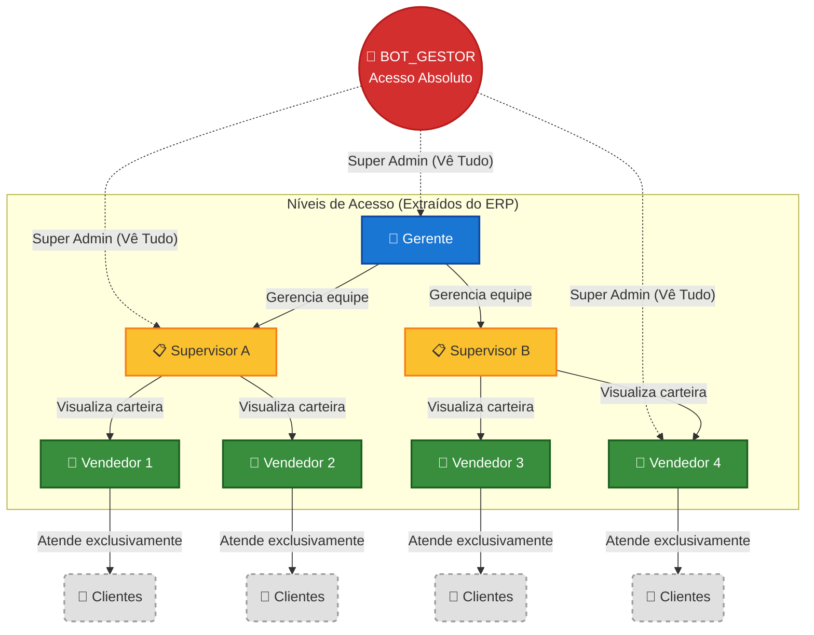

---

## 4. Opções e Funcionalidades do Sistema (Detalhado)

*   **Filtros de Busca Avançada**: Nas telas de Gerentes e Supervisores, a interface não carrega milhares de clientes ao abrir (para economizar recursos). O usuário conta com *Dropdowns* de Vendedores e campos de busca *Live Search* por Razão Social/Fantasia e CNPJ.
*   **Análise de CNPJ e I.E.:** Interfaces dedicadas (restritas a Gerentes, Supervisores e BOT_GESTOR) para conferir a auditoria fiscal automática que os Crons fizeram. Ajuda a descobrir de imediato se um cliente recém-cadastrado possui Inscrição Estadual divergente (Inativa/Baixada) comparada ao que foi colocado no Winthor, evitando emissão de notas problemáticas.
*   **Edição de Contatos e Validação de WhatsApp**: Qualquer nível da hierarquia, dentro da sua limitação de visão, tem autonomia para adicionar ou editar o WhatsApp do cliente na base local (`contatos`), sem necessitar alterar o cadastro rígido do Winthor. O sistema **valida automaticamente e em tempo real** (com ícones ✔️ e ❌) se o número possui conta de WhatsApp ativa via Evolution API, além de armazenar o resultado em cache no banco local.
*   **Catálogo e Cross-sell**: Durante o chat, o vendedor tem atalhos baseados na view de produtos e na tabela de `METRICAS_CROSS_SELL`, sugerindo compras complementares com base no histórico do ERP. O sistema também permite **Geração e Envio de Catálogos (PDF)** superando limitações de CSS (suporte a Tailwind, oklch) com preenchimento **automático do WhatsApp do Vendedor** para que ele receba uma cópia opcional da mídia.
    > [!TIP]
    > **Mapeamento de Imagens de Produtos:** Para que as fotos dos itens apareçam no catálogo e no painel do vendedor, elas devem ser armazenadas no diretório configurado na variável `.env` `IMAGES_DIR` (por padrão: `backend/imagens_produtos/`).
    > **Regra de Nomenclatura:** O nome do arquivo da imagem deve ser **exatamente** o código do produto (`codprod`) no Winthor.
    > Extensões aceitas: `.jpg`, `.png`, `.jpeg`, `.webp`.
    > *Exemplo: Para o produto de código `12345`, salve o arquivo como `12345.jpg`.*
*   **Monitoramento de Filas e Reativação Inteligente**: Supervisores podem observar clientes na `CANAL_REATIVACAO_FILA` para cobrar os vendedores sobre retornos pendentes. A tela de **Reativação** permite disparos em lote estruturados com seleção de templates customizáveis gravados diretamente no banco de dados (suportando grandes textos via campos CLOB/Stream no Oracle).

### 4.1 Auditoria Fiscal Automática (Análise IE e CNPJ)
O módulo de Análise IE atua como um escudo fiscal para a empresa. 
- **Como funciona:** Processos assíncronos (`worker.js`) vasculham clientes recém-cadastrados ou sem auditoria no ERP. Através de integrações com APIs (ex: CNPJ.ws e Sintegra), o sistema valida a situação cadastral do CNPJ e descobre eventuais Inscrições Estaduais vinculadas.
- **Prevenção de Erros:** Vendedores podem acompanhar pelo dashboard (menu Análise IE) clientes que estão com a Inscrição Estadual Inativa, Suspensa ou Baixada.
- **Link Direto SINTEGRA:** Na tela de Análise de IE, o sistema provê um botão direto que abre a página pública do Sintegra, injetando o CNPJ e o Estado (UF) do cliente para comprovação fiscal imediata pelo analista.

### Visualização do Sistema (Dashboard / Frontend)

Abaixo, a sequência de capturas de tela que demonstram a interface do usuário passo a passo:

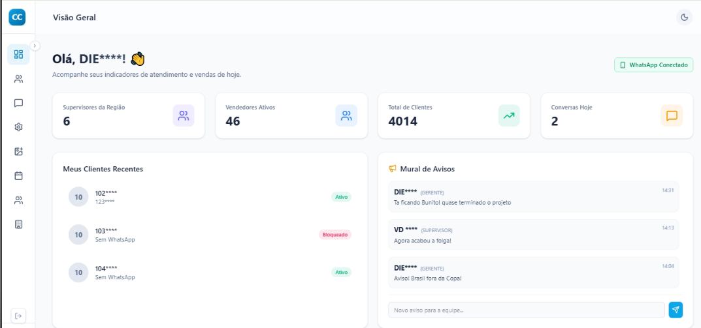
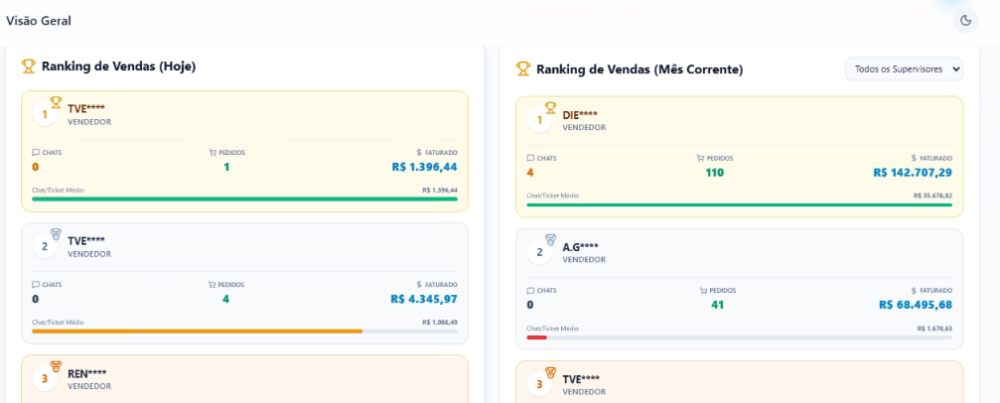
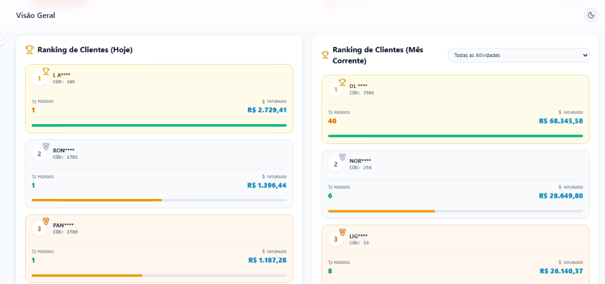
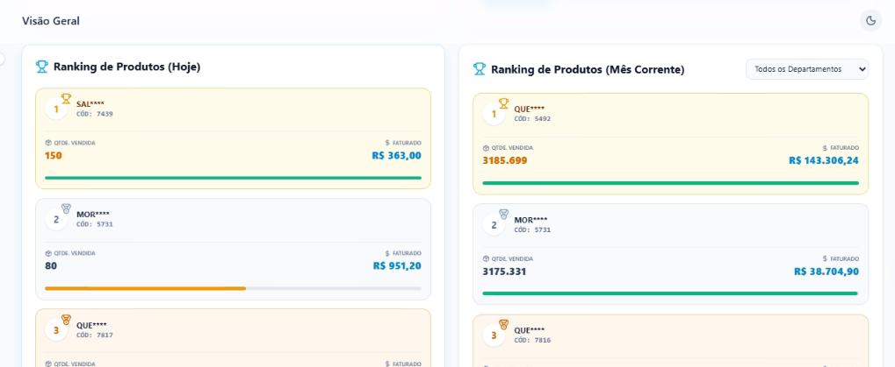
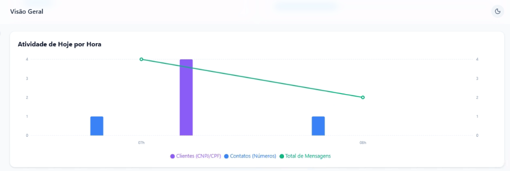
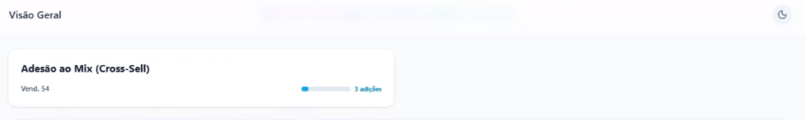
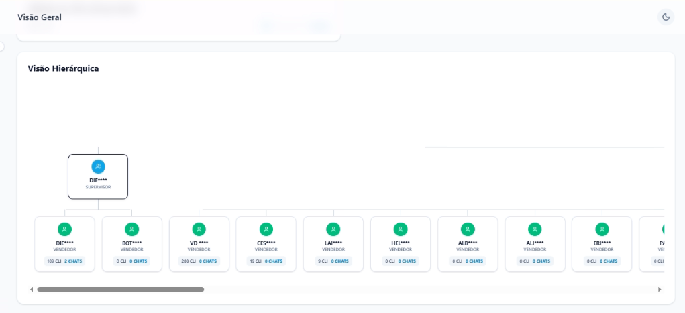
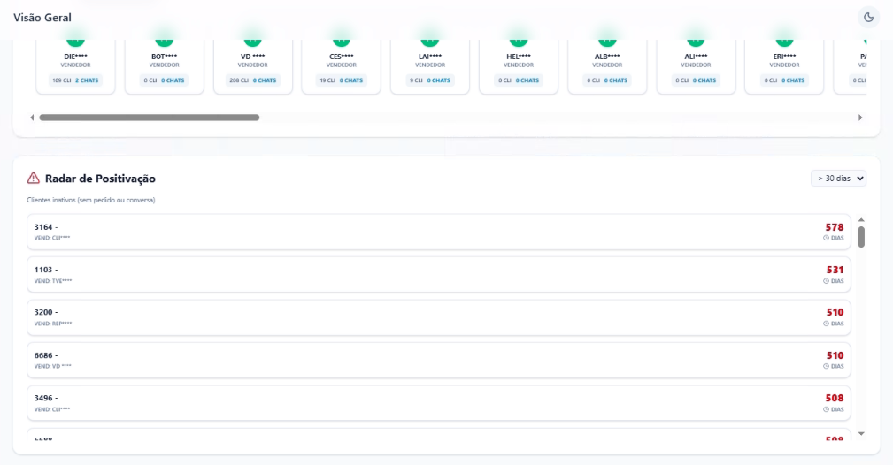
